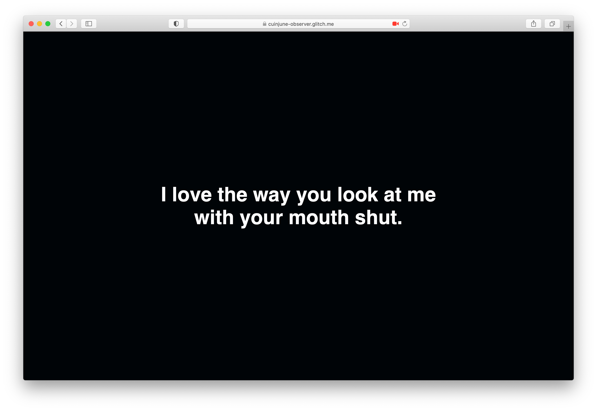

# Observer



## Description

This repo is the week1 assignment of the "Hello, Computer" course at ITP.  
The assignment was to create something that takes non-speech input from a person and responds with speech synthesis.  

I decided to create an app that observes the user's face through the computer's camera, and speaks about it.

Here's the [Live Demo on Glitch](https://cuinjune-observer.glitch.me/).

## How it works

When the app's page loads, it will ask for your permission to access the camera on your computer. You need to allow it to use the app. After the loading is done, you will be asked to click on the page to start the app. This interaction is mainly to initialize the `audioContext`, otherwise the user may not hear any sound from the browser.

When the app starts, the computer will start with a brief greeting and introduction. The user will be able to hear its voice and see the text on the page at the same time. And then, it will begin observing the user's face through the camera and speak about it.

The observing happens in the following order and logic. In each step, it will speak about the result and either move to the next or previous step depending on it:

1. Check if the user's face is present in the camera.
2. Check if the user's face is close enough to the camera.
3. Check if the user is looking at the camera. (Or, more accurately, if the user is directly facing the camera)
4. Check if the user's mouth is closed.

After all these conditions are met, the computer will start praising the user for following its requests. (e.g. "You are the best human I've ever seen")

## Process & Thoughts

For the face tracking part, I reused the code I've written for the [Face DJ](https://github.com/cuinjune/face-dj) app that I created last semester. It uses the [Tensorflow Facemesh library](https://github.com/tensorflow/tfjs-models/tree/master/facemesh) which I think is pretty accurate and performant. So my work this time was basically implementing the speech part using the face detection data (e.g. face position) that I already had.

The implementation of the speech part ended up having many conditions (over 200 lines) to check what the computer previously said, and what the current observed state is. I'm sure there's a simpler/cleaner way to do the same thing but I didn't spend much time thinking about organizing the structure of the code since it's a small project anyway.

The purpose of this project was to explore Text-To-Speech (TTS) technology and create something fun with it rather than creating something useful. So I hope people to enjoy using the app, and I guess nobody will like to be observed by a computer in a serious manner.

I think an interesting use case of this app would be to help people who are being easily distracted (e.g. ADHD) to stay focused while working in front of the computer since the app will notify the user as soon as the user is not looking at or try to move away from the computer screen for instance.

## Setup

1. You need to have [Python](https://realpython.com/installing-python/) installed on your computer
2. Run the following commands in the Terminal
```
git clone https://github.com/cuinjune/observer.git
cd observer
python -m http.server 8080
```
3. Open your web browser and navigate to http://localhost:8080

## Author
* [Zack Lee](https://www.cuinjune.com/about): an MPS Candidate at [NYU ITP](https://itp.nyu.edu).
